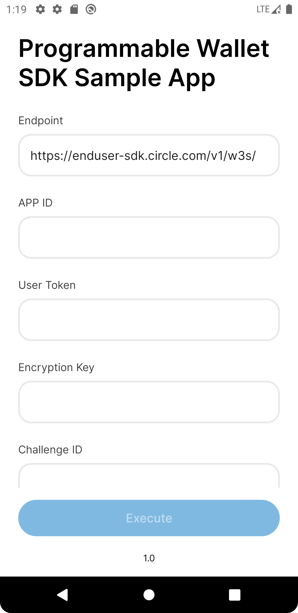

# Circle Programmable Wallet SDK for Android - Sample

> Sample app for integrating Circle Programmable Wallet SDK.

- Bookmark
  - [Requirement](#requirement)
  - [Run the Sample App](#run-the-sample-app)
---


## Requirement

1. Java 17 is required for the sample app.

## Run the Sample App
You can install [the latest APK](https://github.com/circlefin/w3s-android-sample-app-wallets/blob/master/app/build/outputs/apk/debug/app-debug.apk) or follow the instructions below to run on a device / emulator directly.
1. Open the project by [Android Studio](https://developer.android.com/studio): File ➜ Open ➜ choose the project root folder.

 

2. Edit `values/config.xml` ➜ `pw_app_id` to fill in your `APP ID`
3. Add/Edit `local.properties` in the project's root with the following maven repository settings:
```properties
pwsdk.maven.url=https://maven.pkg.github.com/circlefin/w3s-android-sdk
pwsdk.maven.username=<GITHUB_USERNAME>
# Fine-grained personal access tokens or classic with package read permission.
pwsdk.maven.password=<GITHUB_PAT>  
```
> **Note**
> When pasting the values above for `<GITHUB_USERNAME>` and `<GITHUB_PAT>`, make sure to not surround the values with quotes.

- Check the following links for creating PAT.
  - [Creating a personal access token (classic)](https://docs.github.com/en/authentication/keeping-your-account-and-data-secure/managing-your-personal-access-tokens#creating-a-personal-access-token-classic)
  - [Creating a fine-grained personal access token](https://docs.github.com/en/authentication/keeping-your-account-and-data-secure/managing-your-personal-access-tokens#creating-a-fine-grained-personal-access-token)

 4. If there's no error after Gradle sync, select a device and click `Debug 'app'`.

 
 
 5. Fill in the `App ID` and execute it along with `User Token`, `Encryption Key` and `Challenge ID`.    


